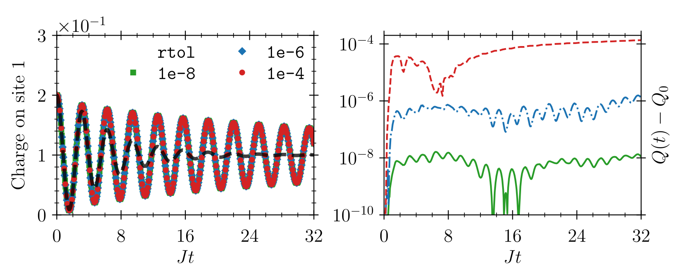

# [Fermi-Hubbard Model II] (@id FHM_II)

!!! note
    This example is the continuation of [Fermi-Hubbard Model I](@ref FHM_I). It is recommended that you familiarize yourself with the latter first.

In part II of our example about the Fermi-Hubbard model, we will solve the so-called ``T``-matrix approximation, which is a "non-perturbative" self-energy resummation. As we saw in [part I](@ref FHM_I), in the standard perturbative second Born approximation, the self-energies are given by
```math
\begin{align*}
    \Sigma^\lessgtr_{ij, \uparrow}  (t, t') = \mathrm{i}U^2 \Phi^\lessgtr_{ij}(t, t') G^\gtrless_{ji, \downarrow}(t', t),\\
    \Sigma^\lessgtr_{ij, \downarrow}(t, t') = \mathrm{i}U^2 \Phi^\lessgtr_{ij}(t, t')G^\gtrless_{ji, \uparrow}(t', t),
\end{align*}
```
where
```math
\begin{align*}
    \left[\boldsymbol{\Phi}^\lessgtr(t, t')\right]_{ij} = \Phi^\lessgtr_{ij}(t, t') = -i G^\lessgtr_{ij, \uparrow}(t, t') G^\lessgtr_{ij, \downarrow}(t, t').
    \end{align*}
```
If we now define the so-called ``T``-matrix
```math
\begin{align*}
    \boldsymbol{T}(t, t') =  \boldsymbol{\Phi}(t, t') - U \int_{\mathcal{C}}\mathrm{d}s\; \boldsymbol{\Phi}(t, s) \boldsymbol{T}(s, t'),
\end{align*}
```
the new self-energies in ``T``-matrix approximation become
```math
\begin{align*}
    \Sigma^\lessgtr_{ij, \uparrow}  (t, t') = \mathrm{i}U^2 T^\lessgtr_{ij}(t, t') G^\gtrless_{ji, \downarrow}(t', t),\\
    \Sigma^\lessgtr_{ij, \downarrow}(t, t') = \mathrm{i}U^2 T^\lessgtr_{ij}(t, t')G^\gtrless_{ji, \uparrow}(t', t),
\end{align*}
```

While we keep the _same initial conditions_ as in [Fermi-Hubbard Model I](@ref FHM_I), we intrdoce a new data `struct` that also holds the ``T``-matrix (and the "bubbles" ``\Phi`` since this is more efficient):
```julia
Base.@kwdef struct FermiHubbardDataTM{T}
    GL_u::T
    GG_u::T
    GL_d::T
    GG_d::T

    ΣL_u::T = zero(GL_u)
    ΣG_u::T = zero(GG_u)
    ΣL_d::T = zero(GL_d)
    ΣG_d::T = zero(GG_d)

    TL::T = zero(GL_u)
    TG::T = zero(GG_u)

    ΦL::T = zero(GL_u)
    ΦG::T = zero(GG_u)
end

data = FermiHubbardDataTM(GL_u=GL_u, GG_u=GG_u, GL_d=GL_d, GG_d=GG_d)

# Initialize T-matrix
data.TL[1, 1] = -1.0im .* GL_u[1, 1] .* GL_d[1, 1]
data.TG[1, 1] = -1.0im .* GG_u[1, 1] .* GG_d[1, 1]
data.ΦL[1, 1] = data.TL[1, 1]
data.ΦG[1, 1] = data.TG[1, 1]
```
!!! note
    As should be clear from the new definition of the self-energies in terms of the ``T``-matrix, the former now contain additional time integrals. This means that at every time step, on top of the Volterra integro-differential equations (VIDEs), we now also have to solve so-called _Volterra integral equations_ (VIEs). Furthermore, it is important for stability reasons to solve these VIEs _implicitly_. For a more detailed discussion, please consult [our paper](https://doi.org/10.21468/SciPostPhysCore.5.2.030).

Accordingly, we introduce an auxiliary fixed-point solver that does this for us:
```julia
function fixed_point(F::Function, x0::AbstractArray; 
        mixing::Float64=0.5, 
        abstol::Float64=1e-12, 
        maxiter::Int=1000, 
        verbose::Bool=true, 
        norm=x -> LinearAlgebra.norm(x, Inf)
    )
    
    x_old = copy(x0)

    step = 0
    while step < maxiter
        x = F(x_old)
        res = norm(x - x_old)
        if verbose
            @info "step: $step // res: $res"
        end
        if res < abstol
            break
        end
        @. x_old = mixing * x + (1.0 - mixing) * x_old
        step += 1
    end

    if step == maxiter
        @warn "No convergence reached."
    end

    return x_old
end
```
Instead of writing one ourselves, we could also have worked directly with [`NLsolve.jl`](https://github.com/JuliaNLSolvers/NLsolve.jl). Note that to keep our number of dependencies low, we have opted for not including this by default.

[As in part I](@ref FHM_I), we define our `FermiHubbardModel`, yet this time with a stronger interaction:
```julia
# Interaction parameter
const U₀ = 2.0
model = FermiHubbardModel(U = t -> U₀)
```
The previous callback `second_Born!` is now replaced with the following:
```julia
# Callback function for the self-energies
function T_matrix!(model, data, times, h1, h2, t, t′)
    # Unpack data and model
    (; GL_u, GG_u, GL_d, GG_d, TL, TG, ΣL_u, ΣG_u, ΣL_d, ΣG_d, ΦL, ΦG) = data
    (; U) = model
        
    # Real-time collision integral
    ∫dt1(A, B, C) = integrate1(h1, t, t′, A, B, C)
    ∫dt2(A, B, C) = integrate2(h2, t, t′, A, B, C)
    
    # Resize self-energies etc. when Green functions are resized
    if (n = size(GL_u, 3)) > size(ΣL_u, 3)
        resize!(ΣL_u, n)
        resize!(ΣG_u, n)
        resize!(ΣL_d, n)
        resize!(ΣG_d, n)
        
        resize!(TL, n)
        resize!(TG, n)
        resize!(ΦL, n)
        resize!(ΦG, n)
    end
    
    # The interaction varies as a function of the forward time (t+t')/2
    U_t = U((times[t] + times[t′])/2)

    # Solve VIEs implicitly
    TL[t, t′], TG[t, t′] = fixed_point([ΦL[t, t′], ΦG[t, t′]]; mixing=0.5, verbose=false) do x
        TL[t, t′], TG[t, t′] = x[1], x[2]
        
        [
            ΦL[t, t′] - U_t * (∫dt1(ΦG, ΦL, TL) + ∫dt2(ΦL, TL, TG)),
            ΦG[t, t′] - U_t * (∫dt1(ΦG, ΦL, TG) + ∫dt2(ΦG, TL, TG))
        ]
    end
    
    # Define the self-energies
    ΣL_u[t, t′] = 1.0im .* U_t^2 .* TL[t, t′] .* transpose(GG_d[t′, t])
    ΣL_d[t, t′] = 1.0im .* U_t^2 .* TL[t, t′] .* transpose(GG_u[t′, t])
    
    ΣG_u[t, t′] = 1.0im .* U_t^2 .* TG[t, t′] .* transpose(GL_d[t′, t])
    ΣG_d[t, t′] = 1.0im .* U_t^2 .* TG[t, t′] .* transpose(GL_u[t′, t])
end
```
For a given final time `tmax`, and tolerances `atol` and `rtol`, [`kbsolve!`](@ref) is ready to solve the problem:
```julia
# Call the solver
sol = kbsolve!(
        (x...) -> fv!(model, data, x...),
        (x...) -> fd!(model, data, x...),
        [data.GL_u, data.GG_u, data.GL_d, data.GG_d],
        (0.0, tmax);
        callback = (x...) -> T_matrix!(model, data, x...),
        atol = atol,
        rtol = rtol,
        dtini=1e-10,
        stop = x -> (println("t: $(x[end])"); flush(stdout); false)
    )
```
At large `tmax=32` and with `atol = 1e-2 rtol`, we obtain



This confirms that the resummation performed by the T-matrix is indeed superior to the second Born approximation in the current regime of large ``U`` and small occupation numbers!

