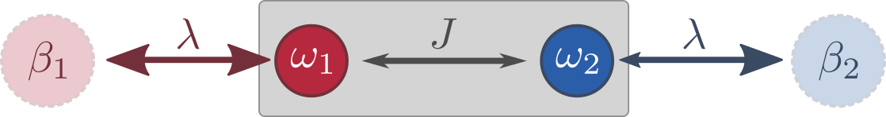

# [Open Bose Dimer] (@id OpenBose)

A nice example to illustrate how one can use `KadanoffBaym.jl` to study *open systems* is the Bose dimer depicted below.

!!! hint
    A [Jupyter notebook](https://github.com/NonequilibriumDynamics/KadanoffBaym.jl/blob/master/examples/bosonic-dimer.ipynb) for this example is available in our [examples folder](https://github.com/NonequilibriumDynamics/KadanoffBaym.jl/tree/master/examples).



It consists of two bosonics modes ``\omega_{1,2}`` (you can imagine two single-mode cavities at different frequencies), which are coupled with strength ``J``. Additionally, each mode is coupled to its own reservoir at inverse temperature ``\beta_{1,2}``, respectively. Such a system is described by the master equation
```math
\begin{align*}
	\partial_{t} \hat{\rho}=-i\left[\hat{H} \hat{\rho}-\hat{\rho} \hat{H}^{
		\dagger}\right]
	+ \lambda\sum_{i=1}^L \left[(N_i + 1)\hat{a}^{\phantom{\dagger}}_i \hat{\rho}  \hat{a}^{\dagger}_i + N_i \hat{a}^{\dagger}_i\hat{\rho}   \hat{a}^{\phantom{\dagger}}_i \right]
\end{align*}
```
for ``[\hat{a}^{\phantom{\dagger}}_i, \hat{a}^{\dagger}_i]=1``, ``i=1, ..., L`` and ``L=2``. The ``N_i=1/(e^{\beta_i \omega_i}-1)`` denote the thermal occupations of the reservoirs. The in this case *non-Hermitian* Hamiltonian is given by
```math
\begin{align*}
    \hat{H}=\sum_{i=1}^L (\omega_{i}-i \lambda (N_i + 1/2)) \hat{a}^{\dagger}_i \hat{a}^{\phantom{\dagger}}_i.
\end{align*}
```
The bosonic *lesser* and *greater* Green functions are 
```math
\begin{align*}
	\left[\boldsymbol{G}^<(t, t')\right]_{ij} &= G^<_{ij}(t, t') = -i\left\langle{\hat{a}_j^{{\dagger}}(t')\hat{a}_i^{\phantom{\dagger}}(t)}\right\rangle, \\
	\left[\boldsymbol{G}^>(t, t')\right]_{ij} &= G^>_{ij}(t, t') = -i\left\langle{\hat{a}_i^{\phantom{\dagger}}(t)\hat{a}_j^{{\dagger}}(t')}\right\rangle.
\end{align*}
```
For convenience, we also introduce the (anti-) time-ordered Green functions
```math
\begin{align*}
	G^{T}_{ij}(t, t') &= \Theta(t - t') G^>_{ij}(t, t') +  \Theta(t' - t) G^<_{ij}(t, t'), \\
	G^{\tilde{T}}_{ij}(t, t') &= \Theta(t - t') G^<_{ij}(t, t') +  \Theta(t' - t) G^>_{ij}(t, t').
\end{align*}
```
With the help of these, we can express the "vertical" equations of motion compactly:
```math
\begin{align*}
	\partial_t \boldsymbol{G}^<(t, t') &= -i \boldsymbol{H} \boldsymbol{G}^<(t, t') + \lambda \operatorname{diag} (N_1, ..., N_L) \boldsymbol{G}^{\tilde{T}}(t, t') , \\
	\partial_t \boldsymbol{G}^>(t, t') &= -i \boldsymbol{H}^\dagger \boldsymbol{G}^>(t, t') - \lambda \operatorname{diag} (N_1 + 1, ..., N_L + 1) \boldsymbol{G}^{{T}}(t, t') ,
\end{align*}
```
where ``\boldsymbol{H} = \operatorname{diag}(\omega_{1}- i\lambda (N_1 + 1/2), ..., \omega_{L}- i\lambda(N_L + 1/2))``. As in our [previous example](@ref TightBinding), we also need the equations in the "diaognal" time direction, which in the present case become
```math
\begin{align*}
	\partial_T {G}_{{ij}}^<(T, 0)_W &= 
	-i \left[\boldsymbol{H} \boldsymbol{G}^<(T, 0)_W - \boldsymbol{G}^<(T, 0)_W \boldsymbol{H}^\dagger\right]_{ij} \\
	&+ \frac{i\lambda}{2} (N_i + N_j) ({G}_{{ij}}^<(T, 0)_W + {G}_{{ij}}^>(T, 0)_W), \\
	\partial_T {G}_{{ij}}^>(T, 0)_W &= -i \left[\boldsymbol{H}^\dagger \boldsymbol{G}^>(T, 0)_W - \boldsymbol{G}^>(T, 0)_W \boldsymbol{H}\right]_{ij} 
	\\
	&- \frac{i\lambda}{2} (N_i + N_j + 2) ({G}_{{ij}}^<(T, 0)_W + {G}_{{ij}}^>(T, 0)_W),
\end{align*}
```
where the subscript ``W`` again indicates *Wigner coordinates*. 

Translating all of this into code is now straightforward! We start by defining the Green functions and their initial conditions:
```julia
using KadanoffBaym, LinearAlgebra

# Lattice size
L = 2

# Allocate the initial Green functions (time arguments at the end)
GL = GreenFunction(zeros(ComplexF64, L, L, 1, 1), SkewHermitian)
GG = GreenFunction(zeros(ComplexF64, L, L, 1, 1), SkewHermitian)

# Initial condition
GL[1, 1] = -im * diagm([0.0, 2])
GG[1, 1] = -im * I(2) + GL[1,1]
```
Then we assign all of the parameters we need:
```julia
# Non-Hermitian Hamiltonian
ω₁ = 2.5
ω₂ = 0.0
J = pi / 4

λ = 1

N₁ = 1.
N₂ = 0.1

H = [ω₁ - 0.5im * λ * ((N₁ + 1) + N₁) J; J ω₂ - 0.5im * λ * ((N₂ + 1) + N₂)]
```
As the last step, we write down the equations of motion:
```julia
# Right-hand side for the "vertical" evolution
function fv!(out, _, _, _, t, t′)
    out[1] = -1.0im * (H * GL[t, t′] + λ * [[1.0im * N₁, 0] [0, 1.0im * N₂]] * GL[t, t′])
    out[2] = -1.0im * (adjoint(H) * GG[t, t′] - 1.0im * λ * [[(N₁ + 1), 0] [0, (N₂ + 1)]] * GG[t, t′])
end
```
Observe how we have converted the (anti-) time-ordered Green functions ``G^{T}, G^{\tilde{T}}`` into lesser and greater functions by explicitly using the fact that we are operating on the ``t>t'`` triangle of the two-time grid ``(t, t')``. By combining `fv!` with its adjoint [as before](@ref TightBinding), we also obtain the "diagonal" equations as
```julia
# Right-hand side for the "diagonal" evolution
function fd!(out, _, _, _, t, t′)
    out[1] = (-1.0im * (H * GL[t, t] - GL[t, t] * adjoint(H)
             + 1.0im * λ * [[N₁ * (GL[1, 1, t, t] + GG[1, 1, t, t]), (N₁ + N₂) * (GL[2, 1, t, t] + GG[2, 1, t, t]) / 2] [(N₁ + N₂) * (GL[1, 2, t, t] + GG[1, 2, t, t]) / 2, N₂ * (GL[2, 2, t, t] + GG[2, 2, t, t])]])
             )
    out[2] = (-1.0im * (adjoint(H) * GG[t, t] - GG[t, t] * H
             - 1.0im * λ * [[(N₁ + 1) * (GL[1, 1, t, t] + GG[1, 1, t, t]), (N₁ + N₂ + 2) * (GG[2, 1, t, t] + GL[2, 1, t, t]) / 2] [(N₁ + N₂ + 2) * (GG[1, 2, t, t] + GL[1, 2, t, t]) / 2, (N₂ + 1) * (GL[2, 2, t, t] + GG[2, 2, t, t])]])
             )
end
```
Calling the solver is again a one-liner:
```julia
sol = kbsolve!(fv!, fd!, [GL, GG], (0.0, 32.0); atol=1e-6, rtol=1e-4)
```

!!! tip
    By importing Julia's `FFTW` and `Interpolations` packages, we can also obtain the Wigner-transformed Green functions.

```julia
using FFTW, Interpolations
function wigner_transform_itp(x::AbstractMatrix, ts::Vector; fourier = true, ts_lin = range(first(ts), last(ts); length = length(ts)))
    itp = interpolate((ts, ts), x, Gridded(Linear()))
    return wigner_transform([itp(t1, t2) for t1 in ts_lin, t2 in ts_lin]; ts = ts_lin, fourier = fourier)
end

ρ_11_wigner, (taus, ts) = wigner_transform_itp((GG.data - GL.data)[1, 1, :, :], sol.t; fourier=false)
ρ_11_FFT, (ωs, ts) = wigner_transform_itp((GG.data - GL.data)[1, 1, :, :], sol.t; fourier=true)
```

If you want to see plots of all the results, you can find those in our corresponding [Jupyter notebook](https://github.com/NonequilibriumDynamics/KadanoffBaym.jl/blob/master/examples/bosonic-dimer.ipynb).