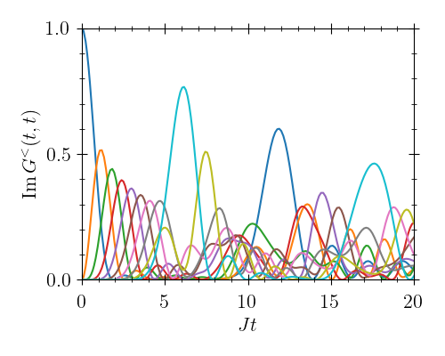

# [Tight-Binding Model] (@id TightBinding)


To get a feeling for how to use `KadanoffBaym.jl`, we begin by solving a simple example, the so-called tight-binding model:
```math

\begin{align*}
	\hat{H} &= \sum_{i=1}^L \varepsilon_i \hat{c}_i^{\dagger} \hat{c}_i^{\phantom{\dagger}} + J \sum_{\langle i, j\rangle}\left(\hat{c}_i^{\dagger} \hat{c}_j^{\phantom{\dagger}} + \hat{c}_j^{\dagger} \hat{c}_i^{\phantom{\dagger}}\right),
\end{align*}

```
where the ``\hat{c}_i^{\dagger},\, \hat{c}_i^{\phantom{\dagger}}`` are fermionic creation and annihilation operators. The model describes a bunch of electrons on a lattice that can hop to neighbouring sites via the coupling ``J``. The usual quantities of interest can be obtained from the so-called *lesser* and *greater* Green functions defined by
```math
\begin{align*}
	\left[\boldsymbol{G}^<(t, t')\right]_{ij} &= G^<_{ij}(t, t') = \phantom{-} i\left\langle{\hat{c}_j^{{\dagger}}(t')\hat{c}_i^{\phantom{\dagger}}(t)}\right\rangle, \\
	\left[\boldsymbol{G}^>(t, t')\right]_{ij} &= G^>_{ij}(t, t') = -i\left\langle{\hat{c}_i^{\phantom{\dagger}}(t)\hat{c}_j^{{\dagger}}(t')}\right\rangle.
\end{align*}
```
The equations of motion for these Green functions in "vertical" and "diagonal" time have a simple form and can be written compactly as
```math
\begin{align*}
	\partial_t \boldsymbol{G}^{\lessgtr}(t, t') &= -i\boldsymbol{H} \boldsymbol{G}^{\lessgtr}(t, t') \\
	\partial_T \boldsymbol{G}^{\lessgtr}(T, 0)_W &= -i[\boldsymbol{H},\boldsymbol{G}^{\lessgtr}(T, 0)_W],
\end{align*}
```
where the square brackets denote the commutator, and the Hamiltonian matrix is given by
```math
\begin{align*}
	\boldsymbol{H} &= 
	\begin{pmatrix}
		\varepsilon_1 & J      &        &   \\
		J             & \ddots & \ddots &   \\
		              & \ddots & \ddots & J \\
		              &        & J & \varepsilon_L 
	\end{pmatrix}.
\end{align*}
```
Remember also that in Wigner coordinates, the "forward" time is defined by ``T = \frac{t+t'}{2}`` and ``\partial_T = \partial_t + \partial_{t'}``.

First, we import `KadanoffBaym.jl` alongside Julia's linear-algebra package:
```julia
using KadanoffBaym, LinearAlgebra
```
Then, we use the built-in data structure [`GreenFunction`](@ref) to define our lesser and greater Green functions
```julia
# Lattice size
L = 10

# Allocate the initial lesser and greater Green functions (time arguments at the end)
GL = GreenFunction(zeros(ComplexF64, L, L, 1, 1), SkewHermitian)
GG = GreenFunction(zeros(ComplexF64, L, L, 1, 1), SkewHermitian)
```

As our initial condition, we put a single electron on lattice site one:
```julia
# Initial occupation
N_0 = 1.0
GL[1, 1] = zeros(ComplexF64, L, L)
GL[1, 1, 1, 1] = 1.0im

# Greater function follows from lesser by anti-commutation
GG[1, 1] = -im * I(L) + GL[1, 1]
```
Note how accessing [`GreenFunction`](@ref) with only *two* arguments gives the whole matrix at a given time, i.e. `GL[1, 1]` is equivalent to `GL[:, :, 1, 1]`.

For illustration, we use a Hamiltonian matrix ``\boldsymbol{H}`` with unit hopping ``J=1`` defined as
```julia
# Spacing of energy levels
ε = 5e-2

# Hamiltonian with on-site energies and nearest-neighbour hopping
H = SymTridiagonal([ε * (i-1) for i in 1:L], -ones(L))
```

We define the equation of motion in the "vertical" time ``t`` as
```julia
# Right-hand side for the "vertical" evolution
function fv!(out, times, h1, h2, t1, t2)
    out[1] = -im * H * GL[t1, t2]
    out[2] = -im * H * GG[t1, t2]
end
```
Finally, the the equation of motion in the "diagonal" time ``T`` follows by subtracting its own adjoint from the vertical equation:
```julia
# Right-hand side for the "diagonal" evolution
function fd!(out, times, h1, h2, t1, t2)
  fv!(out, times, h1, h2, t1, t2)
  out[1] -= adjoint(out[1])
  out[2] -= adjoint(out[2])
end
```
Note that the unused arguments `times, h1, h2` are indeed only necessary when solving *interacting* systems (i.e. systems with integrals in their equations of motion). All that remains to be done is give our definitions to [`kbsolve!`](@ref):
```julia
# Call the solver
@time sol = kbsolve!(fv!, fd!, [GL, GG], (0.0, 20.0); atol=1e-8, rtol=1e-6)
```
When we `plot(sol.t, mapreduce(permutedims, vcat, [imag(diag(GL[t, t])) for t in eachindex(sol.t)]))`, we obtain




